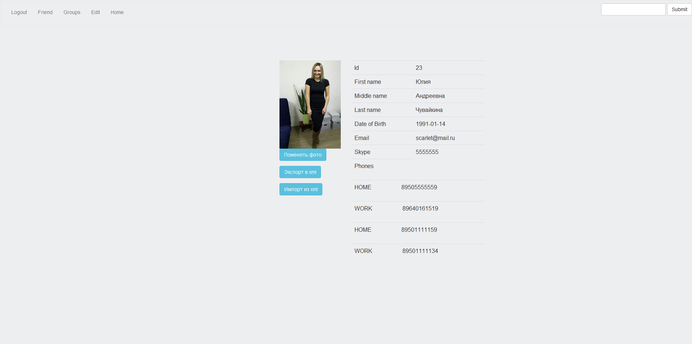
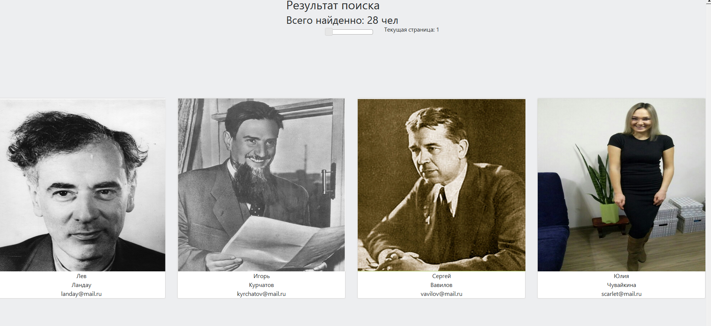

# Yet Another Social Network
 
** Functionality: **
 
+ registration  
+ ajax loading of cities and countries  
+ authentication  
+ ajax search with pagination  
+ display profile  
+ edit profile  
+ edit profile privacy settings  
+ upload and download avatar  
+ users export to xml  
 
** Tools: **  
JDK 7, Spring 4, JPA 2 / Hibernate 4, XStream, jQuery 2, Twitter Bootstrap 3, JUnit 4, Mockito, Maven 3, Git / Bitbucket, Tomcat 7, PostgreSQL, IntelliJIDEA 14.  
 
 
** Notes: **  
SQL ddl is located in the `db/ddl.sql`
 
** Screenshots **

--  
**Немчинов Роман**  
Тренинг getJavaJob,   
[http://www.getjavajob.com](http://www.getjavajob.com)
